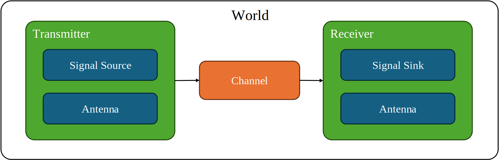

# RF Simulation in Gazebo

## Introduction

`rf_gz` is the Gazebo-side RF simulation package in this workspace. It provides signal-level RF simulation in Gazebo through a world plugin, a demo world, and a launch entry point for the end-to-end RF pipeline.

## Architecture



The package is centered on `rf_gz::RfWorldPlugin`, which loads RF components from the world SDF and coordinates the signal flow during each Gazebo update. 

The simulation is built from the following components:

- `Antenna`: models directional or omnidirectional antenna gain
- `Signal Source`: generates the baseband waveform for a transmitter
- `Signal Sink`: consumes the final receiver output
- `Channel`: models propagation effects between transmitter and receiver
- `Transmitter`: combines a signal source, antenna, and transmit settings
- `Receiver`: combines antenna, receive processing, and a signal sink


## Demo

The demo world provides a simple end-to-end example of the package in use. It launches Gazebo with a preconfigured RF scene and connects the simulated receiver output to the downstream processing pipeline.

To run the demo:

```bash
ros2 launch rf_gz gazebo.launch.py
```

## Authors And Contributors

- Zhongzheng R. Zhang
- Claude Code
- Codex
